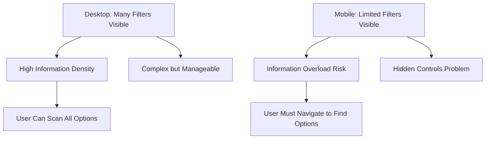

<!-- 
SEO: mobile filter UX, responsive filters, filter design patterns, mobile vs desktop, filter accessibility, touch-friendly filters, frontend, react, best practices, web development
-->

# Mobile Filter UX: Pitfalls, Patterns & Responsive Solutions

Learn how to design effective, accessible, and performant filter interfaces that work seamlessly across desktop and mobile devices. Real-world examples, code patterns, and proven solutions.

---

## 🔍 Table of Contents
- [The Space Constraint Problem](#the-space-constraint-problem)
- [Real-World Filter Patterns](#real-world-filter-patterns)
- [Mobile Filter Pitfalls & Solutions](#mobile-filter-pitfalls--solutions)
- [Responsive Strategy: Desktop to Mobile](#responsive-strategy-desktop-to-mobile)
- [Real-World Case Study: ASOS/Gymshark](#real-world-case-study-asosgymshark)
- [Implementation Examples](#implementation-examples)
- [Mobile Filter Design Checklist](#mobile-filter-design-checklist)
- [Related Topics](#related-topics)
- [FAQ](#faq)

---

## The Space Constraint Problem

### 📱 Mobile vs Desktop: The Fundamental Challenge

Mobile screens (~375–414px width) can't accommodate the same filter interfaces as desktop. This creates a fundamental UX challenge:

**Desktop Reality:**
- Sidebar filters always visible
- Multiple columns of options
- Rich space for counts and controls
- Instant filtering without performance concerns

**Mobile Reality:**
- Limited screen real estate
- Single-column layouts
- Touch interaction constraints
- Network performance considerations

### 🧠 Cognitive Load vs Clarity



---

## Real-World Filter Patterns

### 🔹 Pattern A: Drawer Panel (Side Sheet)

**How it works:** Slide-in filter panel from the side, leaving main content partially visible.

**Real Example:** TodayTix app
- Opens slide-in panel from right side
- Shows 30% of main content for context
- Filters apply immediately on selection
- Smooth animations for open/close

**Code Example (React + Tailwind):**
```tsx
import { useState } from 'react';

export function FilterDrawer({ isOpen, onClose, children }) {
  return (
    <>
      {/* Backdrop */}
      {isOpen && (
        <div 
          className="fixed inset-0 bg-black bg-opacity-50 z-40"
          onClick={onClose}
        />
      )}
      
      {/* Drawer */}
      <div className={`
        fixed top-0 right-0 h-full w-80 bg-white shadow-xl z-50
        transform transition-transform duration-300 ease-in-out
        ${isOpen ? 'translate-x-0' : 'translate-x-full'}
      `}>
        <div className="p-4">
          <div className="flex justify-between items-center mb-4">
            <h2 className="text-lg font-semibold">Filters</h2>
            <button 
              onClick={onClose}
              className="p-2 hover:bg-gray-100 rounded"
            >
              ✕
            </button>
          </div>
          {children}
        </div>
      </div>
    </>
  );
}
```

**Pros:**
- ✅ Maintains browsing context
- ✅ Fast interaction
- ✅ Familiar pattern

**Cons:**
- ❌ Limited space for many filters
- ❌ Still blocks view of main content

---

### 🔹 Pattern B: Full-Screen Filter Page

**How it works:** Dedicated full-screen interface for filtering, user dismisses when done.

**Real Example:** Rent the Runway
- Full-screen overlay with structured sections
- Clear "Apply" and "Clear All" buttons
- Organized by category (Size, Color, Price, etc.)

**Code Example (React + Tailwind):**
```tsx
export function FullScreenFilter({ isOpen, onClose, onApply, filters }) {
  const [selectedFilters, setSelectedFilters] = useState({});
  
  return (
    <div className={`
      fixed inset-0 bg-white z-50 transform transition-transform duration-300
      ${isOpen ? 'translate-x-0' : 'translate-x-full'}
    `}>
      <div className="flex flex-col h-full">
        {/* Header */}
        <div className="flex justify-between items-center p-4 border-b">
          <h1 className="text-xl font-semibold">Filters</h1>
          <button onClick={onClose} className="p-2">✕</button>
        </div>
        
        {/* Filter Content */}
        <div className="flex-1 overflow-y-auto p-4">
          {filters.map(filter => (
            <FilterSection 
              key={filter.id}
              filter={filter}
              selected={selectedFilters[filter.id]}
              onChange={(value) => setSelectedFilters(prev => ({
                ...prev,
                [filter.id]: value
              }))}
            />
          ))}
        </div>
        
        {/* Footer */}
        <div className="p-4 border-t bg-gray-50">
          <div className="flex gap-3">
            <button 
              onClick={() => setSelectedFilters({})}
              className="flex-1 py-3 px-4 border border-gray-300 rounded"
            >
              Clear All
            </button>
            <button 
              onClick={() => onApply(selectedFilters)}
              className="flex-1 py-3 px-4 bg-blue-600 text-white rounded"
            >
              Apply Filters
            </button>
          </div>
        </div>
      </div>
    </div>
  );
}
```

**Pros:**
- ✅ Allows many options
- ✅ Structured layout
- ✅ Clear call-to-action

**Cons:**
- ❌ Takes user out of browsing context entirely
- ❌ Higher cognitive load

---

### 🔹 Pattern C: Inline Top Filters / Horizontal Scroll

**How it works:** Key filters displayed horizontally at the top, with horizontal scrolling for overflow.

**Real Examples:** Amazon's sticky filter bar, Etsy's horizontal filters

**Code Example (React + Tailwind):**
```tsx
export function InlineFilters({ filters, activeFilters, onFilterChange }) {
  return (
    <div className="sticky top-0 bg-white border-b z-30">
      <div className="overflow-x-auto">
        <div className="flex gap-2 p-4 min-w-max">
          {filters.map(filter => (
            <button
              key={filter.id}
              onClick={() => onFilterChange(filter.id)}
              className={`
                px-4 py-2 rounded-full text-sm whitespace-nowrap
                ${activeFilters.includes(filter.id)
                  ? 'bg-blue-600 text-white'
                  : 'bg-gray-100 text-gray-700 hover:bg-gray-200'
                }
              `}
            >
              {filter.label}
              {filter.count && (
                <span className="ml-1 text-xs opacity-75">
                  ({filter.count})
                </span>
              )}
            </button>
          ))}
        </div>
      </div>
    </div>
  );
}
```

**Pros:**
- ✅ Quick access to key filters
- ✅ Visible active filters
- ✅ Compact design

**Cons:**
- ❌ Limited to a few filters
- ❌ Horizontal space constraints
- ❌ Chip truncation/confusion

---

## Mobile Filter Pitfalls & Solutions

### 🚧 1. Overwhelming Option Lists

**Problem:** Users must scroll through long lists in small frames (e.g., many brands, categories).

**Real Example:** Nike's mobile filter for "Brand" shows 50+ options in a tiny scrollable area.

**Solution: Collapsible Sections with Lazy Loading**

```tsx
export function CollapsibleFilterSection({ title, options, isOpen, onToggle }) {
  const [visibleOptions, setVisibleOptions] = useState(options.slice(0, 10));
  const [showMore, setShowMore] = useState(options.length > 10);
  
  return (
    <div className="border-b">
      <button
        onClick={onToggle}
        className="w-full flex justify-between items-center p-4"
      >
        <span className="font-medium">{title}</span>
        <span className="text-gray-500">{isOpen ? '−' : '+'}</span>
      </button>
      
      {isOpen && (
        <div className="px-4 pb-4">
          {visibleOptions.map(option => (
            <label key={option.id} className="flex items-center py-2">
              <input type="checkbox" className="mr-3" />
              <span>{option.label}</span>
              <span className="ml-auto text-gray-500 text-sm">
                ({option.count})
              </span>
            </label>
          ))}
          
          {showMore && (
            <button
              onClick={() => {
                setVisibleOptions(options);
                setShowMore(false);
              }}
              className="text-blue-600 text-sm mt-2"
            >
              Show all {options.length} options
            </button>
          )}
        </div>
      )}
    </div>
  );
}
```

---

### 🚧 2. Inconsistent Apply Behavior

**Problem:** Some filters apply instantly while others require explicit "Apply" button.

**Real Example:** Airbnb's mobile filters - price range applies instantly, but amenities require "Show X places" button.

**Solution: Consistent UX Pattern**

```tsx
// Choose ONE pattern and stick to it:

// Pattern 1: Auto-apply (good for simple filters)
export function AutoApplyFilter({ options, onFilterChange }) {
  return (
    <div>
      {options.map(option => (
        <label key={option.id} className="flex items-center py-2">
          <input 
            type="checkbox" 
            onChange={(e) => onFilterChange(option.id, e.target.checked)}
            className="mr-3"
          />
          <span>{option.label}</span>
        </label>
      ))}
    </div>
  );
}

// Pattern 2: Batch apply (good for complex filters)
export function BatchApplyFilter({ options, selectedFilters, onApply }) {
  const [pendingFilters, setPendingFilters] = useState(selectedFilters);
  
  return (
    <div>
      {options.map(option => (
        <label key={option.id} className="flex items-center py-2">
          <input 
            type="checkbox" 
            checked={pendingFilters.includes(option.id)}
            onChange={(e) => {
              if (e.target.checked) {
                setPendingFilters([...pendingFilters, option.id]);
              } else {
                setPendingFilters(pendingFilters.filter(id => id !== option.id));
              }
            }}
            className="mr-3"
          />
          <span>{option.label}</span>
        </label>
      ))}
      
      <div className="mt-4 p-4 bg-gray-50 rounded">
        <button 
          onClick={() => onApply(pendingFilters)}
          className="w-full py-3 bg-blue-600 text-white rounded"
        >
          Apply Filters ({pendingFilters.length})
        </button>
      </div>
    </div>
  );
}
```

---

### 🚧 3. Hidden Active Filters

**Problem:** Users can't recall which filters are applied without a summary.

**Real Example:** Many e-commerce apps hide active filters, leading to user confusion.

**Solution: Sticky Chip Bar**

```tsx
export function ActiveFiltersBar({ activeFilters, onRemoveFilter, onClearAll }) {
  if (activeFilters.length === 0) return null;
  
  return (
    <div className="sticky top-16 bg-white border-b z-20">
      <div className="flex items-center gap-2 p-3 overflow-x-auto">
        <span className="text-sm text-gray-600 whitespace-nowrap">
          Active:
        </span>
        
        {activeFilters.map(filter => (
          <div
            key={filter.id}
            className="flex items-center gap-1 bg-blue-100 text-blue-800 px-3 py-1 rounded-full text-sm whitespace-nowrap"
          >
            <span>{filter.label}</span>
            <button
              onClick={() => onRemoveFilter(filter.id)}
              className="ml-1 hover:bg-blue-200 rounded-full w-4 h-4 flex items-center justify-center"
            >
              ×
            </button>
          </div>
        ))}
        
        <button
          onClick={onClearAll}
          className="text-sm text-gray-500 hover:text-gray-700 whitespace-nowrap"
        >
          Clear all
        </button>
      </div>
    </div>
  );
}
```

---

### 🚧 4. Tiny Touch Targets

**Problem:** Checkboxes and labels too small, leading to mis-taps.

**Solution: Thumb-Friendly Touch Targets**

```tsx
export function TouchFriendlyFilter({ options, selectedFilters, onFilterChange }) {
  return (
    <div>
      {options.map(option => (
        <label 
          key={option.id} 
          className="flex items-center p-4 border-b hover:bg-gray-50"
          style={{ minHeight: '44px' }} // iOS minimum touch target
        >
          <input 
            type="checkbox" 
            checked={selectedFilters.includes(option.id)}
            onChange={(e) => onFilterChange(option.id, e.target.checked)}
            className="w-5 h-5 mr-4" // Larger checkbox
          />
          <div className="flex-1">
            <div className="font-medium">{option.label}</div>
            <div className="text-sm text-gray-500">
              {option.count} items
            </div>
          </div>
        </label>
      ))}
    </div>
  );
}
```

---

### 🚧 5. Blocked Browsing Context

**Problem:** Full-screen filters disconnect users from browsing results.

**Solution: Context-Preserving Overlays**

```tsx
export function ContextPreservingFilter({ isOpen, onClose, children }) {
  return (
    <div className={`
      fixed inset-0 z-50
      ${isOpen ? 'block' : 'hidden'}
    `}>
      {/* Semi-transparent backdrop */}
      <div 
        className="absolute inset-0 bg-black bg-opacity-30"
        onClick={onClose}
      />
      
      {/* Filter panel (takes 70% of screen, leaves 30% for context) */}
      <div className="absolute right-0 top-0 h-full w-3/4 bg-white shadow-xl">
        <div className="flex flex-col h-full">
          <div className="flex justify-between items-center p-4 border-b">
            <h2 className="text-lg font-semibold">Filters</h2>
            <button onClick={onClose} className="p-2">✕</button>
          </div>
          
          <div className="flex-1 overflow-y-auto">
            {children}
          </div>
        </div>
      </div>
    </div>
  );
}
```

---

### 🚧 6. Zero-Results Frustration

**Problem:** Options that yield no results are often hidden or removed.

**Solution: Show Disabled States with Counts**

```tsx
export function ZeroResultAwareFilter({ options, onFilterChange }) {
  return (
    <div>
      {options.map(option => {
        const isDisabled = option.count === 0;
        
        return (
          <label 
            key={option.id} 
            className={`
              flex items-center p-4 border-b
              ${isDisabled ? 'opacity-50 cursor-not-allowed' : 'hover:bg-gray-50'}
            `}
          >
            <input 
              type="checkbox" 
              disabled={isDisabled}
              onChange={(e) => onFilterChange(option.id, e.target.checked)}
              className="w-5 h-5 mr-4"
            />
            <div className="flex-1">
              <div className="font-medium">{option.label}</div>
              <div className="text-sm text-gray-500">
                {isDisabled ? 'No items available' : `${option.count} items`}
              </div>
            </div>
          </label>
        );
      })}
    </div>
  );
}
```

---

### 🚧 7. Performance Bottlenecks

**Problem:** Live filtering with each tap slows under mobile networks.

**Solution: Debounced Filtering with Loading States**

```tsx
import { useState, useEffect, useCallback } from 'react';
import { debounce } from 'lodash';

export function PerformanceOptimizedFilter({ options, onFilterChange }) {
  const [selectedFilters, setSelectedFilters] = useState([]);
  const [isLoading, setIsLoading] = useState(false);
  
  // Debounce filter changes to avoid excessive API calls
  const debouncedFilterChange = useCallback(
    debounce((filters) => {
      setIsLoading(true);
      onFilterChange(filters).finally(() => setIsLoading(false));
    }, 300),
    [onFilterChange]
  );
  
  const handleFilterChange = (filterId, isSelected) => {
    const newFilters = isSelected 
      ? [...selectedFilters, filterId]
      : selectedFilters.filter(id => id !== filterId);
    
    setSelectedFilters(newFilters);
    debouncedFilterChange(newFilters);
  };
  
  return (
    <div>
      {isLoading && (
        <div className="p-4 text-center text-gray-500">
          Updating results...
        </div>
      )}
      
      {options.map(option => (
        <label key={option.id} className="flex items-center p-4 border-b">
          <input 
            type="checkbox" 
            checked={selectedFilters.includes(option.id)}
            onChange={(e) => handleFilterChange(option.id, e.target.checked)}
            className="w-5 h-5 mr-4"
          />
          <span>{option.label}</span>
          <span className="ml-auto text-gray-500 text-sm">
            ({option.count})
          </span>
        </label>
      ))}
    </div>
  );
}
```

---

## Responsive Strategy: Desktop to Mobile

| Desktop (Sidebar) | Mobile Best Practice |
|-------------------|---------------------|
| Always-on sidebar filters in left column | Single floating "Filter" button |
| Shows all filters at once | Drawer or Full‑screen overlay |
| Rich space for counts and controls | Stick active filters visible via chips |
| Multi-column checkboxes | Collapsible groups, lazy search/filter list |
| Instant filtering OK | Batch apply if network slow or many options |

**Implementation Strategy:**

```tsx
export function ResponsiveFilterContainer({ filters, isMobile }) {
  const [isFilterOpen, setIsFilterOpen] = useState(false);
  
  if (isMobile) {
    return (
      <>
        {/* Mobile: Floating filter button */}
        <button
          onClick={() => setIsFilterOpen(true)}
          className="fixed bottom-6 right-6 bg-blue-600 text-white p-4 rounded-full shadow-lg z-40"
        >
          <span className="sr-only">Filters</span>
          <svg className="w-6 h-6" fill="none" stroke="currentColor" viewBox="0 0 24 24">
            <path strokeLinecap="round" strokeLinejoin="round" strokeWidth={2} d="M3 4a1 1 0 011-1h16a1 1 0 011 1v2.586a1 1 0 01-.293.707l-6.414 6.414a1 1 0 00-.293.707V17l-4 4v-6.586a1 1 0 00-.293-.707L3.293 7.293A1 1 0 013 6.586V4z" />
          </svg>
        </button>
        
        {/* Mobile: Full-screen filter overlay */}
        <FullScreenFilter
          isOpen={isFilterOpen}
          onClose={() => setIsFilterOpen(false)}
          filters={filters}
        />
      </>
    );
  }
  
  // Desktop: Always-visible sidebar
  return (
    <div className="w-64 border-r bg-gray-50 p-4">
      <h2 className="text-lg font-semibold mb-4">Filters</h2>
      <DesktopFilterList filters={filters} />
    </div>
  );
}
```

---

## Real-World Case Study: ASOS/Gymshark Mobile UX

### 🎯 The Strategy

**ASOS and Gymshark** have mastered mobile filter UX through a hybrid approach:

1. **Inline Key Filters:** Price, Size, Color shown with count badges
2. **"More Filters" Button:** Opens full-screen overlay with collapsible sections
3. **Active Filter Chips:** Persistent display of applied filters

### 📱 Implementation Pattern

```tsx
export function ASOSStyleFilter({ products, filters }) {
  const [activeFilters, setActiveFilters] = useState({});
  const [isMoreFiltersOpen, setIsMoreFiltersOpen] = useState(false);
  
  // Key filters shown inline
  const keyFilters = ['price', 'size', 'color'];
  
  return (
    <div>
      {/* Inline key filters */}
      <div className="sticky top-0 bg-white border-b z-30">
        <div className="flex items-center gap-2 p-4 overflow-x-auto">
          {keyFilters.map(filterKey => {
            const filter = filters.find(f => f.key === filterKey);
            return (
              <button
                key={filterKey}
                onClick={() => {/* Open filter modal */}}
                className="flex items-center gap-2 px-4 py-2 bg-gray-100 rounded-full text-sm"
              >
                <span>{filter.label}</span>
                {activeFilters[filterKey] && (
                  <span className="bg-blue-600 text-white text-xs px-2 py-1 rounded-full">
                    {activeFilters[filterKey].length}
                  </span>
                )}
              </button>
            );
          })}
          
          <button
            onClick={() => setIsMoreFiltersOpen(true)}
            className="px-4 py-2 border border-gray-300 rounded-full text-sm"
          >
            More Filters
          </button>
        </div>
      </div>
      
      {/* Active filters chips */}
      {Object.keys(activeFilters).length > 0 && (
        <div className="sticky top-16 bg-white border-b z-20">
          <div className="flex items-center gap-2 p-3 overflow-x-auto">
            {Object.entries(activeFilters).map(([key, values]) => 
              values.map(value => (
                <div key={`${key}-${value}`} className="flex items-center gap-1 bg-blue-100 text-blue-800 px-3 py-1 rounded-full text-sm">
                  <span>{value}</span>
                  <button
                    onClick={() => {/* Remove filter */}}
                    className="ml-1 hover:bg-blue-200 rounded-full w-4 h-4 flex items-center justify-center"
                  >
                    ×
                  </button>
                </div>
              ))
            )}
          </div>
        </div>
      )}
      
      {/* More filters overlay */}
      <FullScreenFilter
        isOpen={isMoreFiltersOpen}
        onClose={() => setIsMoreFiltersOpen(false)}
        filters={filters.filter(f => !keyFilters.includes(f.key))}
        onApply={(newFilters) => {
          setActiveFilters({ ...activeFilters, ...newFilters });
          setIsMoreFiltersOpen(false);
        }}
      />
    </div>
  );
}
```

### ✅ Advantages of This Approach

- **Balances critical filters inline** with extended options in overlay
- **Preserves browsing context** with chip bar
- **Reduces cognitive load** by prioritizing most-used filters
- **Maintains performance** through smart loading strategies

---

## Implementation Examples

### 🎨 Complete Mobile Filter Component

```tsx
import React, { useState, useCallback } from 'react';
import { debounce } from 'lodash';

export function MobileFilterSystem({ filters, onFilterChange, products }) {
  const [isOpen, setIsOpen] = useState(false);
  const [selectedFilters, setSelectedFilters] = useState({});
  const [isLoading, setIsLoading] = useState(false);
  
  // Debounced filter application
  const debouncedApply = useCallback(
    debounce((filters) => {
      setIsLoading(true);
      onFilterChange(filters).finally(() => setIsLoading(false));
    }, 300),
    [onFilterChange]
  );
  
  const handleFilterChange = (filterKey, value) => {
    const newFilters = { ...selectedFilters, [filterKey]: value };
    setSelectedFilters(newFilters);
    debouncedApply(newFilters);
  };
  
  const activeFilterCount = Object.values(selectedFilters).flat().length;
  
  return (
    <>
      {/* Filter Button */}
      <button
        onClick={() => setIsOpen(true)}
        className="fixed bottom-6 right-6 bg-blue-600 text-white p-4 rounded-full shadow-lg z-40 flex items-center gap-2"
      >
        <svg className="w-5 h-5" fill="none" stroke="currentColor" viewBox="0 0 24 24">
          <path strokeLinecap="round" strokeLinejoin="round" strokeWidth={2} d="M3 4a1 1 0 011-1h16a1 1 0 011 1v2.586a1 1 0 01-.293.707l-6.414 6.414a1 1 0 00-.293.707V17l-4 4v-6.586a1 1 0 00-.293-.707L3.293 7.293A1 1 0 013 6.586V4z" />
        </svg>
        <span>Filters</span>
        {activeFilterCount > 0 && (
          <span className="bg-red-500 text-white text-xs px-2 py-1 rounded-full">
            {activeFilterCount}
          </span>
        )}
      </button>
      
      {/* Filter Overlay */}
      <div className={`
        fixed inset-0 bg-white z-50 transform transition-transform duration-300
        ${isOpen ? 'translate-x-0' : 'translate-x-full'}
      `}>
        <div className="flex flex-col h-full">
          {/* Header */}
          <div className="flex justify-between items-center p-4 border-b">
            <h1 className="text-xl font-semibold">Filters</h1>
            <button onClick={() => setIsOpen(false)} className="p-2">✕</button>
          </div>
          
          {/* Filter Content */}
          <div className="flex-1 overflow-y-auto">
            {filters.map(filter => (
              <FilterSection
                key={filter.key}
                filter={filter}
                selected={selectedFilters[filter.key] || []}
                onChange={(value) => handleFilterChange(filter.key, value)}
              />
            ))}
          </div>
          
          {/* Footer */}
          <div className="p-4 border-t bg-gray-50">
            <div className="flex gap-3">
              <button 
                onClick={() => setSelectedFilters({})}
                className="flex-1 py-3 px-4 border border-gray-300 rounded"
              >
                Clear All
              </button>
              <button 
                onClick={() => setIsOpen(false)}
                className="flex-1 py-3 px-4 bg-blue-600 text-white rounded"
              >
                Done
              </button>
            </div>
          </div>
        </div>
      </div>
      
      {/* Loading Indicator */}
      {isLoading && (
        <div className="fixed top-4 right-4 bg-black bg-opacity-75 text-white px-4 py-2 rounded z-50">
          Updating results...
        </div>
      )}
    </>
  );
}

function FilterSection({ filter, selected, onChange }) {
  const [isExpanded, setIsExpanded] = useState(false);
  
  return (
    <div className="border-b">
      <button
        onClick={() => setIsExpanded(!isExpanded)}
        className="w-full flex justify-between items-center p-4"
      >
        <span className="font-medium">{filter.label}</span>
        <span className="text-gray-500">{isExpanded ? '−' : '+'}</span>
      </button>
      
      {isExpanded && (
        <div className="px-4 pb-4">
          {filter.options.map(option => (
            <label 
              key={option.value} 
              className="flex items-center py-3 min-h-[44px]"
            >
              <input 
                type="checkbox" 
                checked={selected.includes(option.value)}
                onChange={(e) => {
                  if (e.target.checked) {
                    onChange([...selected, option.value]);
                  } else {
                    onChange(selected.filter(v => v !== option.value));
                  }
                }}
                className="w-5 h-5 mr-4"
              />
              <div className="flex-1">
                <div className="font-medium">{option.label}</div>
                <div className="text-sm text-gray-500">
                  {option.count} items
                </div>
              </div>
            </label>
          ))}
        </div>
      )}
    </div>
  );
}
```

---

## Mobile Filter Design Checklist

### 🧭 Key Filters & Access
- [ ] Only high‑value filters (price, size, stock) shown inline/top bar
- [ ] Single, always-visible "Filter" button to open overlay or drawer

### 🏗 Filter UI Patterns
- [ ] Use drawer (side sheet) or fullscreen overlay for extended filtering
- [ ] Overlay should partially maintain browsing context if possible

### 🛠 Behavior & Interaction
- [ ] Apply filters either immediately or via a clear "Apply" button
- [ ] Consistent behavior—do not mix modes
- [ ] Offer "Clear all" and per-filter removal options

### 🤚 Touch & Layout
- [ ] Touch targets ≥44×44 px
- [ ] Controls accessible via thumb (bottom or floating UI)

### 👀 Visibility & Feedback
- [ ] Active filters shown persistently (chips bar or badge)
- [ ] Show counts next to each filter option
- [ ] Show disabled state (not hide) for zero-result filters
- [ ] Provide suggestions if filters yield no results

### 🚀 Performance Handling
- [ ] Debounce auto-filter actions or use batch apply
- [ ] Show loaders or skeletons during filtering

### 🧾 Long Option Sets
- [ ] Use collapsible sections or lazy loading
- [ ] Avoid infinite vertical scroll within small panes

### ♿ Accessibility
- [ ] Semantic inputs with ARIA labels and support for keyboard
- [ ] Text labels for visual-only filters (like colors/icons)

### 🧪 Edge Cases & Fallbacks
- [ ] Inform users when no results appear; suggest remedial filters
- [ ] Provide fallback UI if JavaScript fails

---


## ❓ FAQ

**Q: What's the best filter pattern for mobile?**
A: Hybrid approach: key filters inline + "More Filters" button for extended options.

**Q: How to handle performance on slow networks?**
A: Use debounced filtering, batch apply, and show loading states.

**Q: Should filters apply instantly or with a button?**
A: Choose one pattern and stick to it consistently across your app.

**Q: How to ensure accessibility for mobile filters?**
A: Use semantic HTML, ARIA labels, keyboard navigation, and adequate touch targets.

---

**If you found this guide useful, please ⭐️ the repo and share your own mobile filter UX tips!** 
