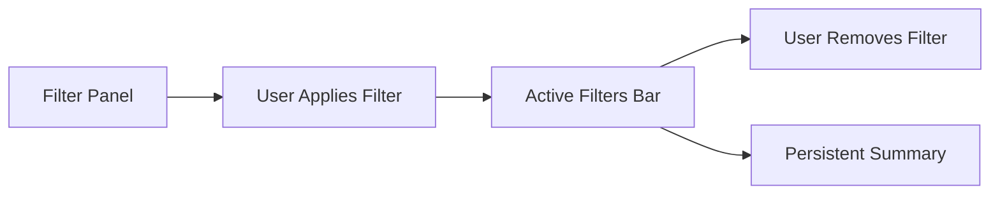

<!--
SEO: mobile filter UX, filter pitfalls, mobile filters best practices, accessibility, touch targets, filter summary, debounce, batch apply, ARIA, real-world apps, frontend, react, web development
-->

# Common Pitfalls in Mobile Filter Interfaces & How to Solve Them

Designing filter interfaces for mobile is a minefield of usability, accessibility, and performance traps. Here’s a detailed guide with real-world patterns, code, diagrams, and a comprehensive checklist.

---

## 📚 Table of Contents

- [1. Losing Context / Scroll Reset](#1-losing-context--scroll-reset)
- [2. Difficulty Discovering Applied Filters](#2-difficulty-discovering-applied-filters)
- [3. Tiny Scrollable Panes](#3-tiny-scrollable-panes)
- [4. Touch Target & Layout Issues](#4-touch-target--layout-issues)
- [5. Filtering Mechanism Confusion](#5-filtering-mechanism-confusion)
- [6. Hidden or Disabled Options Not Communicated](#6-hidden-or-disabled-options-not-communicated)
- [7. Overfetching / Slow Performance](#7-overfetching--slow-performance)
- [8. Inconsistent or Hidden Reset Mechanism](#8-inconsistent-or-hidden-reset-mechanism)
- [9. Poor Accessibility](#9-poor-accessibility)
- [10. Lack of Adaptive Filter Prioritization](#10-lack-of-adaptive-filter-prioritization)
- [✅ Mobile Filter UX Checklist](#mobile-filter-ux-checklist)
- [FAQ](#faq)

---

## 1. Losing Context / Scroll Reset

**Problem:**  
When filters apply, the page reloads or scroll jumps, disorienting users.

**Solution:**  
- Preserve scroll position and viewport context (e.g. keep user at same location).
- Use floating feedback (snackbars or inline indicators) to confirm filters apply without leaving page.

**Code Snippet:**
```tsx
// After applying filters, restore scroll position
const scrollY = window.scrollY;
applyFilters();
window.scrollTo(0, scrollY);
```

---

## 2. Difficulty Discovering Applied Filters

**Problem:**  
On small screens, it's hard to see which filters are active.

**Solution:**  
- Use a horizontal chip list or stacked summary at top showing active filters (“Clear x” badges).
- Make removal easy (tap “x” on filter).
- Always visible even after closing the filter panel.

**Diagram:**


**Code Snippet:**
```tsx
<ActiveFiltersBar
  activeFilters={activeFilters}
  onRemoveFilter={removeFilter}
  onClearAll={clearAllFilters}
/>
```

---

## 3. Tiny Scrollable Panes

**Problem:**  
Long check-box lists in filters show only a few items and force excessive scrolling.

**Solution:**  
- Avoid multi-column micro-scroll areas.
- Use full-screen modals or slideovers where filter categories expand vertically.
- Group options concisely and use “Show more” controls if very long.

---

## 4. Touch Target & Layout Issues

**Problem:**  
Small tap targets, awkward positioning, fat-finger errors.

**Solution:**  
- Ensure filter options follow platform touch guidelines (min ~44×44 px).
- Use thumb-accessible patterns: bottom drawer, sticky FAB button, or sidebar slide-in reachable with thumb.

**Code Snippet:**
```tsx
<label style={{ minHeight: '44px' }}>
  <input type="checkbox" />
  <span>Option</span>
</label>
```

---

## 5. Filtering Mechanism Confusion

**Problem:**  
Mixed behaviors: some filters apply instantly, others only on “Apply”, causing confusion.

**Solution:**  
- Choose one pattern: either reactive (instant) or batch (Apply button).
- If reactive, keep filter drawer open while results update.
- If batch, clearly label the Apply button and show confirmation feedback.

---

## 6. Hidden or Disabled Options Not Communicated

**Problem:**  
Filters that yield 0 results hide or light-grey out without explanation, confusing users.

**Solution:**  
- Don’t hide; instead disable zero-result options and show counts.
- Provide tooltip or inline note like “No items match this option”.
- If user chooses option that leads to no results, show suggestion to remove it.

**Code Snippet:**
```tsx
<input type="checkbox" disabled={option.count === 0} />
<span>{option.label} ({option.count})</span>
```

---

## 7. Overfetching / Slow Performance

**Problem:**  
Mobile under poor network may struggle with live fetching on each filter click.

**Solution:**  
- Use batch filtering or debounce interactive filters with feedback.
- Show lightweight skeletons or spinners.
- Only fetch when drawer closed or "Apply" pressed if network is slow.

**Code Snippet:**
```tsx
const debouncedApply = useCallback(debounce(applyFilters, 300), []);
```

---

## 8. Inconsistent or Hidden Reset Mechanism

**Problem:**  
Users can’t easily remove filters or reset all, especially if buried deep in UI.

**Solution:**  
- Provide visible “Clear All” at top and per-filter removal.
- Confirm bulk clears or show undo option.
- Ensure visibility in filter summary area.

---

## 9. Poor Accessibility

**Problem:**  
ARIA labels missing, keyboard navigation broken, color-only filters inaccessible.

**Solution:**  
- Use semantic HTML (<input>, <label>, <fieldset>, ARIA roles).
- Ensure keyboard focus, screen-reader tags (aria-selected, aria-label).
- For color swatches, include text labels or tooltips.

**Code Snippet:**
```html
<input type="checkbox" aria-label="Filter by size: M" />
```

---

## 10. Lack of Adaptive Filter Prioritization

**Problem:**  
Mobile UI shows all filters equally, including less relevant ones first, confusing users.

**Solution:**  
- Dynamically prioritize critical filters for mobile—Price, Availability, Size.
- Hide secondary ones in expandable groups.

---

## ✅ Mobile Filter UX Checklist

### 👀 Context & Interaction
- [ ] Applying filters does **not reset scroll position** or viewport.
- [ ] Users receive immediate feedback (snackbars/spinners), without “jump”.

### 🧩 Visibility of Active Filters
- [ ] Active filters are always visible in a summary bar.
- [ ] Each can be removed with a clear “x”.
- [ ] Summary persists after closing the filter pane.

### 🧭 Filter Panel Design
- [ ] No tiny scrollable panes for filter options.
- [ ] Use full-screen modal, bottom drawer, or sidebar overlay.
- [ ] Filter categories are collapsible if long.

### 🎯 Touch & Layout
- [ ] Touch targets meet accessibility size (~44 × 44 px).
- [ ] Filter activation button accessible by thumb (sticky bottom or visible FAB).

### 🔁 Apply Behavior
- [ ] Choose either reactive (instant) or batch (Apply button).
- [ ] If reactive, drawer remains open while results update.
- [ ] If batch, Apply button clearly labeled and obvious.

### 🚫 Disabled vs Hidden Options
- [ ] Options yielding 0 results are shown disabled (not hidden).
- [ ] Show counts for each filter option (including 0).
- [ ] Provide suggestions if user picks filter with no results.

### ⚡ Performance & Fetch
- [ ] Debounce reactive filters, or use batch fetch for low-bandwidth.
- [ ] Show loader or skeleton placeholders during fetch.

### 🧼 Clear & Undo
- [ ] "Clear All Filters" button visible at top of filter pane.
- [ ] Each active filter has its own clear control.
- [ ] Provide undo/cancel feedback after clearing.

### 🌐 Accessibility
- [ ] Full keyboard navigation supported.
- [ ] ARIA attributes (`aria-label`, `aria-selected`) on filter controls.
- [ ] Color or icon-based filters have textual alternative.

### 🧠 Relevant Filtering
- [ ] Prioritize key filters (Price, Size, Availability).
- [ ] Secondary filters hidden or collapsed by default.
- [ ] Structure reflects real user intent/behavior per category.

### 🧪 Error & Edge Cases
- [ ] Handle zero-result states: show message + suggestions.
- [ ] Ensure filters degrade gracefully if JS fails (progressive enhancement).
- [ ] Include fallback design/behavior for failure or empty dataset.

---


## ❓ FAQ

**Q: Should I use instant or batch apply for filters?**  
A: Choose one and be consistent. For complex filters or slow networks, batch apply is safer.

**Q: How do I make filters accessible?**  
A: Use semantic HTML, ARIA, keyboard navigation, and text alternatives for icons/colors.

**Q: How do I handle zero-result filters?**  
A: Show disabled state with count, and suggest removing the filter.

---

**If you found this guide useful, please ⭐️ the repo and share your own mobile filter UX tips!** 
