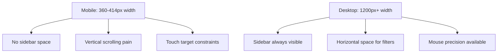

<!--
SEO: mobile vs desktop filters, filter constraints, responsive filter design, mobile filter patterns, touch-friendly filters, filter performance, frontend, react, web development, UX patterns
-->

# Mobile vs Desktop Filter Constraints: Production Patterns & Solutions

Understanding the fundamental differences between mobile and desktop filter interfaces is crucial for building effective, accessible, and performant applications. This guide explores real-world patterns, constraints, and proven solutions.

---

## 📚 Table of Contents

- [Key Mobile Constraints vs Desktop](#key-mobile-constraints-vs-desktop)
- [Production-Proven UX Patterns](#production-proven-ux-patterns)
- [UX Improvement Opportunities](#ux-improvement-opportunities)
- [Implementation Examples](#implementation-examples)
- [Mobile Filter UX Checklist](#mobile-filter-ux-checklist)
- [Related Topics](#related-topics)
- [FAQ](#faq)

---

## Key Mobile Constraints vs Desktop

### 📱 Screen Real Estate Limitations

**Mobile Reality:**
- Limited screen width (~360–414px): sidebar filters don't fit
- Reduced vertical space: long lists become painful to scroll
- Touch & thumb ergonomics: tight UI leads to mis-taps

**Desktop Reality:**
- Abundant horizontal space: sidebar filters always visible
- Generous vertical space: long lists manageable
- Mouse precision: small targets acceptable



### 🧠 Performance & Network Constraints

**Mobile Challenges:**
- Slower networks (3G/4G vs WiFi)
- Limited memory and processing power
- Battery life considerations
- Context switching: filters often take users away from product view

**Desktop Advantages:**
- Stable, fast connections
- Powerful hardware
- No battery concerns
- Multi-window capability

---

## Production-Proven UX Patterns

### ✅ A. Inline Quick Filters + Full-Screen Overlay

**Real Examples:** ASOS, Gymshark mobile apps

**How it works:**
- Display 3–4 key filters inline (Price / Size / Color) with badge counts
- "More filters" opens full-screen panel
- Active filters shown as persistent chips

**Code Example (React + Tailwind):**
```tsx
export function InlineQuickFilters({ keyFilters, onFilterChange, onMoreFilters }) {
  return (
    <div className="sticky top-0 bg-white border-b z-30">
      <div className="flex items-center gap-2 p-4 overflow-x-auto">
        {keyFilters.map(filter => (
          <button
            key={filter.key}
            onClick={() => onFilterChange(filter.key)}
            className="flex items-center gap-2 px-4 py-2 bg-gray-100 rounded-full text-sm whitespace-nowrap"
          >
            <span>{filter.label}</span>
            {filter.count > 0 && (
              <span className="bg-blue-600 text-white text-xs px-2 py-1 rounded-full">
                {filter.count}
              </span>
            )}
          </button>
        ))}
        
        <button
          onClick={onMoreFilters}
          className="px-4 py-2 border border-gray-300 rounded-full text-sm"
        >
          More Filters
        </button>
      </div>
    </div>
  );
}
```

**Pros:** ✅ Keeps browsing context, quick initial filtering  
**Cons:** ❌ Limited inline options, requires two-step flow

---

### ✅ B. Drawer Panel (Side or Bottom Sheet)

**Real Examples:** Enterprise apps - Pencil & Paper pattern

**How it works:**
- Side panel overlay preserves partial content visibility
- Bottom drawer is thumb-accessible
- Can be live-filtering or batch with Apply

**Code Example (React + Tailwind):**
```tsx
export function FilterDrawer({ isOpen, onClose, children, position = 'side' }) {
  const drawerClasses = position === 'side' 
    ? 'fixed top-0 right-0 h-full w-80 bg-white shadow-xl z-50 transform transition-transform duration-300'
    : 'fixed bottom-0 left-0 right-0 h-3/4 bg-white shadow-xl z-50 transform transition-transform duration-300';
  
  const transformClasses = isOpen 
    ? 'translate-x-0' 
    : position === 'side' ? 'translate-x-full' : 'translate-y-full';
  
  return (
    <>
      {isOpen && (
        <div 
          className="fixed inset-0 bg-black bg-opacity-50 z-40"
          onClick={onClose}
        />
      )}
      
      <div className={`${drawerClasses} ${transformClasses}`}>
        <div className="flex flex-col h-full">
          <div className="flex justify-between items-center p-4 border-b">
            <h2 className="text-lg font-semibold">Filters</h2>
            <button onClick={onClose} className="p-2">✕</button>
          </div>
          
          <div className="flex-1 overflow-y-auto p-4">
            {children}
          </div>
        </div>
      </div>
    </>
  );
}
```

**Pros:** ✅ Preserves context, accessible, works with many filters  
**Cons:** ❌ Limited height, complexity in deep nested filters

---

### ✅ C. Progressive Disclosure + Sticky Apply

**Real Examples:** Enterprise dashboards (Shelter Market enterprise UI)

**How it works:**
- Filters grouped and collapsible
- "Apply" button stays sticky at bottom/top
- Users expand sections intentionally

**Code Example (React + Tailwind):**
```tsx
export function ProgressiveDisclosureFilter({ filterGroups, onApply }) {
  const [expandedGroups, setExpandedGroups] = useState(new Set());
  const [pendingFilters, setPendingFilters] = useState({});
  
  const toggleGroup = (groupId) => {
    const newExpanded = new Set(expandedGroups);
    if (newExpanded.has(groupId)) {
      newExpanded.delete(groupId);
    } else {
      newExpanded.add(groupId);
    }
    setExpandedGroups(newExpanded);
  };
  
  return (
    <div className="flex flex-col h-full">
      <div className="flex-1 overflow-y-auto p-4">
        {filterGroups.map(group => (
          <div key={group.id} className="border-b">
            <button
              onClick={() => toggleGroup(group.id)}
              className="w-full flex justify-between items-center p-4"
            >
              <span className="font-medium">{group.label}</span>
              <span className="text-gray-500">
                {expandedGroups.has(group.id) ? '−' : '+'}
              </span>
            </button>
            
            {expandedGroups.has(group.id) && (
              <div className="px-4 pb-4">
                {group.options.map(option => (
                  <label key={option.id} className="flex items-center py-2">
                    <input 
                      type="checkbox" 
                      checked={pendingFilters[option.id] || false}
                      onChange={(e) => setPendingFilters(prev => ({
                        ...prev,
                        [option.id]: e.target.checked
                      }))}
                      className="mr-3"
                    />
                    <span>{option.label}</span>
                    <span className="ml-auto text-gray-500 text-sm">
                      ({option.count})
                    </span>
                  </label>
                ))}
              </div>
            )}
          </div>
        ))}
      </div>
      
      {/* Sticky Apply Button */}
      <div className="p-4 border-t bg-gray-50">
        <button 
          onClick={() => onApply(pendingFilters)}
          className="w-full py-3 bg-blue-600 text-white rounded"
        >
          Apply Filters
        </button>
      </div>
    </div>
  );
}
```

**Pros:** ✅ Manages long lists gracefully, avoids overwhelm  
**Cons:** ❌ Hidden options require extra taps, less exploratory

---

### ✅ D. Batch‑Filtering vs Live Filtering

**Real Examples:** Enterprise vs consumer apps

**How it works:**
- Batch (Apply button) works better on mobile with poor connectivity or many options
- Live filtering works only when performance is reliable

**Code Example (React + Tailwind):**
```tsx
// Batch Filtering Pattern
export function BatchFilter({ filters, onApply }) {
  const [pendingFilters, setPendingFilters] = useState({});
  const [isLoading, setIsLoading] = useState(false);
  
  const handleApply = async () => {
    setIsLoading(true);
    try {
      await onApply(pendingFilters);
    } finally {
      setIsLoading(false);
    }
  };
  
  return (
    <div className="flex flex-col h-full">
      <div className="flex-1 overflow-y-auto p-4">
        {/* Filter options */}
        {filters.map(filter => (
          <FilterOption
            key={filter.id}
            filter={filter}
            selected={pendingFilters[filter.id] || []}
            onChange={(value) => setPendingFilters(prev => ({
              ...prev,
              [filter.id]: value
            }))}
          />
        ))}
      </div>
      
      {/* Sticky Apply Button */}
      <div className="p-4 border-t bg-gray-50">
        <button 
          onClick={handleApply}
          disabled={isLoading}
          className="w-full py-3 bg-blue-600 text-white rounded disabled:opacity-50"
        >
          {isLoading ? 'Applying...' : 'Apply Filters'}
        </button>
      </div>
    </div>
  );
}

// Live Filtering Pattern
export function LiveFilter({ filters, onFilterChange }) {
  const [selectedFilters, setSelectedFilters] = useState({});
  
  const handleFilterChange = (filterId, value) => {
    const newFilters = { ...selectedFilters, [filterId]: value };
    setSelectedFilters(newFilters);
    onFilterChange(newFilters); // Immediate application
  };
  
  return (
    <div className="p-4">
      {filters.map(filter => (
        <FilterOption
          key={filter.id}
          filter={filter}
          selected={selectedFilters[filter.id] || []}
          onChange={(value) => handleFilterChange(filter.id, value)}
        />
      ))}
    </div>
  );
}
```

**Pros (batch):** ✅ Less interruptions, more control  
**Cons:** ❌ Slower feedback, not exploratory  
**→ Live works only if fast; otherwise frustrating**

---

### ✅ E. Native UI Components for Performance & Familiarity

**Real Examples:** Google Fonts mobile, iOS filters

**How it works:**
- Use native dropdowns, pickers, toggles—fast and familiar
- Leverage OS accessibility and standard touch behavior

**Code Example (React + Tailwind):**
```tsx
export function NativeFilterComponents({ filters }) {
  return (
    <div className="p-4 space-y-4">
      {/* Native Select */}
      <div>
        <label className="block text-sm font-medium mb-2">Category</label>
        <select className="w-full p-3 border border-gray-300 rounded">
          <option value="">All Categories</option>
          <option value="electronics">Electronics</option>
          <option value="clothing">Clothing</option>
          <option value="books">Books</option>
        </select>
      </div>
      
      {/* Native Range Input */}
      <div>
        <label className="block text-sm font-medium mb-2">Price Range</label>
        <input 
          type="range" 
          min="0" 
          max="1000" 
          className="w-full"
        />
        <div className="flex justify-between text-sm text-gray-500 mt-1">
          <span>$0</span>
          <span>$1000</span>
        </div>
      </div>
      
      {/* Native Toggle */}
      <div className="flex items-center justify-between">
        <label className="text-sm font-medium">In Stock Only</label>
        <input type="checkbox" className="w-6 h-6" />
      </div>
    </div>
  );
}
```

**Pros:** ✅ High performance, OS accessibility, standard touch behavior  
**Cons:** ❌ Less visual customization, may vary between platforms

---

## UX Improvement Opportunities

| Problem | Approach | Pros | Cons |
|---------|----------|------|------|
| Too many filters overwhelm | Use progressive disclosure (collapsible groups) | Keeps UI tidy, manageable | Users must open groups manually |
| Lost browsing context | Use side drawer or inline chips | Users remain oriented | Drawer may still obscure content |
| Misfires or fat-finger taps | Big touch targets, bottom sheet triggers | Reduces tap errors | Needs more vertical space |
| Poor performance on filtering | Choose batch apply with debounce | Reliable; avoids network overload | Not exploratory; waits needed |
| Users don't see active filters | Use chip summary or badge count | Transparency, easy uncheck | Must manage chip overflow UI |
| Zero-result confusion | Show disabled options with counts, warnings | Avoids surprises | Extra UI logic needed |
| Rare filters crowd UX | Hide low-use filters in "More" or advanced panel | Simplifies main view | Users must explore deeper |
| Accessibility issues | Use semantic HTML / ARIA / native inputs | Supports keyboard/screen readers | Requires dev attention |

---

## Implementation Examples

### 🎨 Complete Mobile Filter System

```tsx
import React, { useState, useCallback } from 'react';
import { debounce } from 'lodash';

export function MobileFilterSystem({ filters, onFilterChange, products }) {
  const [isOpen, setIsOpen] = useState(false);
  const [selectedFilters, setSelectedFilters] = useState({});
  const [isLoading, setIsLoading] = useState(false);
  
  // Debounced filter application for performance
  const debouncedApply = useCallback(
    debounce((filters) => {
      setIsLoading(true);
      onFilterChange(filters).finally(() => setIsLoading(false));
    }, 300),
    [onFilterChange]
  );
  
  const handleFilterChange = (filterKey, value) => {
    const newFilters = { ...selectedFilters, [filterKey]: value };
    setSelectedFilters(newFilters);
    debouncedApply(newFilters);
  };
  
  const activeFilterCount = Object.values(selectedFilters).flat().length;
  
  return (
    <>
      {/* Floating Filter Button */}
      <button
        onClick={() => setIsOpen(true)}
        className="fixed bottom-6 right-6 bg-blue-600 text-white p-4 rounded-full shadow-lg z-40 flex items-center gap-2"
      >
        <svg className="w-5 h-5" fill="none" stroke="currentColor" viewBox="0 0 24 24">
          <path strokeLinecap="round" strokeLinejoin="round" strokeWidth={2} d="M3 4a1 1 0 011-1h16a1 1 0 011 1v2.586a1 1 0 01-.293.707l-6.414 6.414a1 1 0 00-.293.707V17l-4 4v-6.586a1 1 0 00-.293-.707L3.293 7.293A1 1 0 013 6.586V4z" />
        </svg>
        <span>Filters</span>
        {activeFilterCount > 0 && (
          <span className="bg-red-500 text-white text-xs px-2 py-1 rounded-full">
            {activeFilterCount}
          </span>
        )}
      </button>
      
      {/* Filter Overlay */}
      <div className={`
        fixed inset-0 bg-white z-50 transform transition-transform duration-300
        ${isOpen ? 'translate-x-0' : 'translate-x-full'}
      `}>
        <div className="flex flex-col h-full">
          {/* Header */}
          <div className="flex justify-between items-center p-4 border-b">
            <h1 className="text-xl font-semibold">Filters</h1>
            <button onClick={() => setIsOpen(false)} className="p-2">✕</button>
          </div>
          
          {/* Filter Content */}
          <div className="flex-1 overflow-y-auto">
            {filters.map(filter => (
              <FilterSection
                key={filter.key}
                filter={filter}
                selected={selectedFilters[filter.key] || []}
                onChange={(value) => handleFilterChange(filter.key, value)}
              />
            ))}
          </div>
          
          {/* Footer */}
          <div className="p-4 border-t bg-gray-50">
            <div className="flex gap-3">
              <button 
                onClick={() => setSelectedFilters({})}
                className="flex-1 py-3 px-4 border border-gray-300 rounded"
              >
                Clear All
              </button>
              <button 
                onClick={() => setIsOpen(false)}
                className="flex-1 py-3 px-4 bg-blue-600 text-white rounded"
              >
                Done
              </button>
            </div>
          </div>
        </div>
      </div>
      
      {/* Loading Indicator */}
      {isLoading && (
        <div className="fixed top-4 right-4 bg-black bg-opacity-75 text-white px-4 py-2 rounded z-50">
          Updating results...
        </div>
      )}
    </>
  );
}

function FilterSection({ filter, selected, onChange }) {
  const [isExpanded, setIsExpanded] = useState(false);
  
  return (
    <div className="border-b">
      <button
        onClick={() => setIsExpanded(!isExpanded)}
        className="w-full flex justify-between items-center p-4"
      >
        <span className="font-medium">{filter.label}</span>
        <span className="text-gray-500">{isExpanded ? '−' : '+'}</span>
      </button>
      
      {isExpanded && (
        <div className="px-4 pb-4">
          {filter.options.map(option => (
            <label 
              key={option.value} 
              className="flex items-center py-3 min-h-[44px]"
            >
              <input 
                type="checkbox" 
                checked={selected.includes(option.value)}
                onChange={(e) => {
                  if (e.target.checked) {
                    onChange([...selected, option.value]);
                  } else {
                    onChange(selected.filter(v => v !== option.value));
                  }
                }}
                className="w-5 h-5 mr-4"
              />
              <div className="flex-1">
                <div className="font-medium">{option.label}</div>
                <div className="text-sm text-gray-500">
                  {option.count} items
                </div>
              </div>
            </label>
          ))}
        </div>
      )}
    </div>
  );
}
```

---

## Mobile Filter UX Checklist

### Core UI Pattern
- [ ] Display 3–4 key filters inline (top bar or chips)
- [ ] Provide "More filters" button to launch full-screen overlay
- [ ] Use full-screen overlay or drawer, not micro-scroll panels

### Filter Behavior
- [ ] Choose **batch apply** or **live filtering**, not a mix
- [ ] If batch: Apply button is sticky and visible throughout
- [ ] If live: overlay stays open while results update

### Layout & Touch
- [ ] Touch targets ≥44×44 px
- [ ] Controls reachable with thumb (bottom sheet or FAB)
- [ ] Use collapsible groups for long option lists

### Feedback & Clarity
- [ ] Show number of active filters (chip list or badge on button)
- [ ] Show counts per filter option even if zero
- [ ] Disable (don't hide) zero-result options
- [ ] Show warning or suggestion if a filter yields no results

### Performance
- [ ] Batch apply or debounce live filtering
- [ ] Show loading placeholders or skeletons on change

### Native Use
- [ ] Prefer OS-native dropdowns / toggles / pickers for stability/performance
- [ ] Avoid fully custom list components unless necessary

### Accessibility
- [ ] Use semantic inputs (`<label>`, `<input>`, `<fieldset>`)
- [ ] Provide ARIA attributes (`aria-label`, `aria-checked`)
- [ ] Color-only filters include text or tooltips

### Context & Navigation
- [ ] Preserve scroll position on filter exit
- [ ] Sync filter state in URL (if web/app) for share/back navigation
- [ ] Provide "Clear all filters" and per-filter remove options

---

## 📚 Related Topics

- [Mobile Filter UX: Pitfalls, Patterns & Responsive Solutions](cases/mobile-filter-ux-pitfalls-and-solutions.md)
- [Common Pitfalls in Mobile Filter Interfaces & How to Solve Them](cases/mobile-filters-pitfails.md)

---

## ❓ FAQ

**Q: Should I use batch or live filtering on mobile?**  
A: Use batch filtering for complex filters or slow networks. Live filtering only if performance is reliable.

**Q: What's the best filter pattern for mobile?**  
A: Inline quick filters + full-screen overlay (like ASOS) or drawer panel for enterprise apps.

**Q: How do I handle performance on mobile?**  
A: Use native components, debounce filtering, batch apply, and show loading states.

**Q: What about accessibility?**  
A: Use semantic HTML, ARIA attributes, native inputs, and ensure keyboard navigation.

---

**If you found this guide useful, please ⭐️ the repo and share your own mobile filter UX tips!** 
