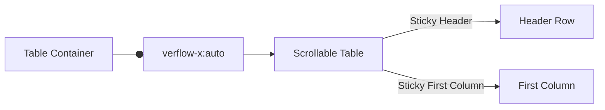
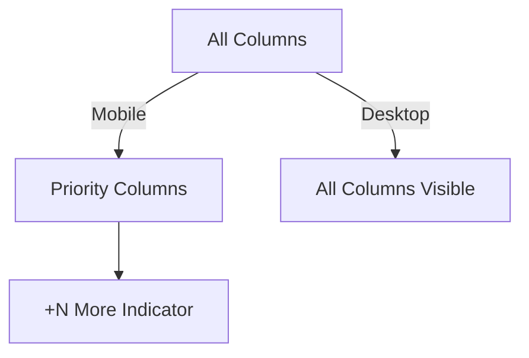
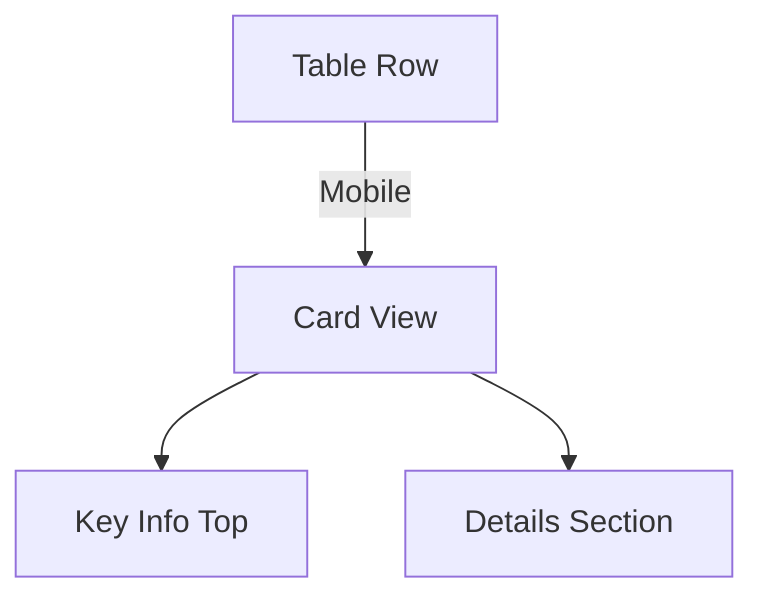
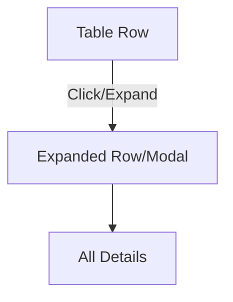

<!-- 
SEO: responsive data tables, mobile-first, UX patterns, best practices, frontend, react, accessibility, table design, web development
-->

# Responsive Data Tables: UX Patterns & Mobile-First Best Practices

Learn how to design responsive, mobile-friendly data tables with modern UX patterns and accessibility in mind. Avoid common pitfalls and deliver a great experience on all devices.

---

## 🔍 Table of Contents
- [Why Responsive Tables Are Hard](#why-responsive-tables-are-hard)
- [Common Responsive Table Patterns](#common-responsive-table-patterns)
- [UX Laws Applied](#ux-laws-applied)
- [Real-World Examples](#real-world-examples)
- [Related Topics](#related-topics)
- [FAQ](#faq)

---

## Why Responsive Tables Are Hard

Data tables are inherently dense and information-rich UI components. On desktop, users expect to see many columns and rows at once, scan data quickly, and perform complex actions. On mobile screens, it’s impossible to show everything at once without sacrificing usability.

**UX pitfalls:**
- Horizontal scrolling is awkward and often undiscoverable.
- Important data can be hidden or lost.
- Users lose context as they scroll.
- Interactions (sort, filter, select, drag) become harder and less discoverable.

---

## Common Responsive Table Patterns

### 1. Horizontal Scroll

#### **Diagram**


#### **Code Example (React + Tailwind)**
```tsx
// Pattern: Horizontal Scroll with Sticky Header/Column
// Why: Preserves table structure, all columns accessible, familiar UX
// Read more: https://css-tricks.com/responsive-data-tables/#horizontal-scroll

export function ResponsiveTable({ columns, data }) {
  return (
    <div className="overflow-x-auto w-full relative">
      <table className="min-w-full border-collapse">
        <thead className="sticky top-0 bg-white z-10">
          <tr>
            {columns.map((col, idx) => (
              <th
                key={col.key}
                className={idx === 0 ? "sticky left-0 bg-white z-20" : ""}
              >
                {col.label}
              </th>
            ))}
          </tr>
        </thead>
        <tbody>
          {data.map((row, rIdx) => (
            <tr key={rIdx}>
              {columns.map((col, idx) => (
                <td
                  key={col.key}
                  className={idx === 0 ? "sticky left-0 bg-white z-10" : ""}
                >
                  {row[col.key]}
                </td>
              ))}
            </tr>
          ))}
        </tbody>
      </table>
      {/* UX: Add fade or arrow indicator for scroll */}
      <div className="absolute right-0 top-0 h-full w-6 pointer-events-none bg-gradient-to-l from-white" />
    </div>
  );
}
```

---

### 2. Column Hiding/Prioritization

#### **Diagram**


#### **Code Example (React + Tailwind)**
```tsx
// Pattern: Column Prioritization with "More" Indicator
// Why: Shows only key columns on mobile, keeps UI clean
// Read more: https://css-tricks.com/responsive-data-tables/#column-hiding

export function PriorityTable({ columns, data, mobileColumns }) {
  const isMobile = window.innerWidth < 640;
  const visibleColumns = isMobile ? mobileColumns : columns;
  return (
    <div className="overflow-x-auto w-full">
      <table className="min-w-full border-collapse">
        <thead>
          <tr>
            {visibleColumns.map(col => (
              <th key={col.key}>{col.label}</th>
            ))}
            {isMobile && columns.length > mobileColumns.length && (
              <th>+{columns.length - mobileColumns.length} more</th>
            )}
          </tr>
        </thead>
        <tbody>
          {data.map((row, rIdx) => (
            <tr key={rIdx}>
              {visibleColumns.map(col => (
                <td key={col.key}>{row[col.key]}</td>
              ))}
              {isMobile && columns.length > mobileColumns.length && (
                <td>
                  <button
                    aria-label="Show more columns"
                    className="underline text-blue-600"
                    onClick={() => alert('Show more details')}
                  >
                    More
                  </button>
                </td>
              )}
            </tr>
          ))}
        </tbody>
      </table>
    </div>
  );
}
```

---

### 3. Card/List View

#### **Diagram**


#### **Code Example (React + Tailwind)**
```tsx
// Pattern: Card/List View for Mobile
// Why: Optimized for touch, easy to scan, flexible layout
// Read more: https://uxdesign.cc/design-better-data-tables-4ecc99d23356

export function CardListTable({ data, columns }) {
  return (
    <div className="flex flex-col gap-4">
      {data.map((row, idx) => (
        <div key={idx} className="bg-white rounded shadow p-4">
          <div className="font-bold text-lg">{row[columns[0].key]}</div>
          <div className="text-sm text-gray-600">{row[columns[1].key]}</div>
          <details className="mt-2">
            <summary className="cursor-pointer text-blue-600">Details</summary>
            <ul className="mt-2">
              {columns.slice(2).map(col => (
                <li key={col.key}>
                  <span className="font-semibold">{col.label}:</span> {row[col.key]}
                </li>
              ))}
            </ul>
          </details>
        </div>
      ))}
    </div>
  );
}
```

---

### 4. Expandable Rows / Details Modal

#### **Diagram**


#### **Code Example (React + Tailwind)**
```tsx
// Pattern: Expandable Row / Details Modal
// Why: Clean UI, all data accessible on demand, avoids clutter
// Read more: https://mui.com/material-ui/react-table/#collapsible-table

import { useState } from 'react';

export function ExpandableTable({ columns, data }) {
  const [expanded, setExpanded] = useState(null);
  return (
    <table className="min-w-full border-collapse">
      <thead>
        <tr>
          {columns.map(col => (
            <th key={col.key}>{col.label}</th>
          ))}
          <th>Details</th>
        </tr>
      </thead>
      <tbody>
        {data.map((row, idx) => (
          <>
            <tr key={idx}>
              {columns.map(col => (
                <td key={col.key}>{row[col.key]}</td>
              ))}
              <td>
                <button
                  aria-label="Expand row"
                  onClick={() => setExpanded(expanded === idx ? null : idx)}
                  className="text-blue-600 underline"
                >
                  {expanded === idx ? 'Hide' : 'Show'}
                </button>
              </td>
            </tr>
            {expanded === idx && (
              <tr>
                <td colSpan={columns.length + 1}>
                  <div className="bg-gray-50 p-4 rounded">
                    {/* Render all details here */}
                    <pre className="text-xs">{JSON.stringify(row, null, 2)}</pre>
                  </div>
                </td>
              </tr>
            )}
          </>
        ))}
      </tbody>
    </table>
  );
}
```

---

## UX Laws Applied

- 🎯 **Fitts’s Law:** All interactive elements (buttons, menus, drag handles) should be large and easy to tap (at least 40x40px). [Read more](https://lawsofux.com/fittss-law/)
- 🧠 **Hick’s Law:** Don’t overload users with options—show only the most important columns or actions by default. [Read more](https://lawsofux.com/hicks-law/)
- 📣 **Feedback Principle:** Always provide clear feedback for user actions (e.g., highlight selected row, animate expansion, show scroll indicators). [Read more](https://www.nngroup.com/articles/feedback/)
- ✨ **Aesthetic-Usability Effect:** Clean, minimalist design helps users perceive the table as easier to use. [Read more](https://lawsofux.com/aesthetic-usability-effect/)

---

## Real-World Examples

- **Google Sheets mobile:** Uses horizontal scroll with sticky headers and columns. Tap targets are large, and there’s a clear visual cue for scrolling.
- **Airtable mobile:** Allows switching between table and card views. Card view is optimized for mobile, with key info at the top.
- **GitHub Issues mobile:** Shows a list with key info; tapping an item opens a details view with all fields.

---

## 📚 Related Topics
- [Scalable Data Table UX: Best Practices](data-table-ux-best-practices.md)
- [Drag-and-Drop Data Table for Mobile & Desktop](drag-and-drop-table-mobile-production.md)
- [Best Data Table Libraries (2024)](../sources/best-data-table-libraries.md)
- Accessibility (WCAG, ARIA)
- Table Virtualization (React Window, TanStack)
- UX Laws (Fitts’s, Hick’s)

---

## ❓ FAQ

**Q: How do I make tables responsive for mobile?**
A: Use horizontal scroll, column hiding, card/list view, or expandable rows. Prioritize key columns for mobile.

**Q: What’s the best pattern for responsive tables?**
A: It depends on your data and users. Card/list view and column prioritization are most mobile-friendly.

**Q: How to ensure accessibility?**
A: Use semantic HTML, ARIA roles, keyboard navigation, and screen reader labels.

---

**If you found this guide useful, please ⭐️ the repo and share your own responsive table tips!** 
